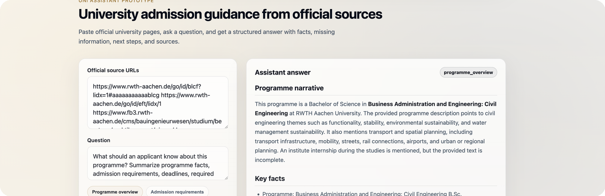

<p align="center">
  
</p>

<table>
  <tr>
    <td width="96">
      
    </td>
    <td>
      <h1>Uni-Assist</h1>
      <strong>Applicant decision brief</strong><br />
      University admission guidance from official sources.
    </td>
  </tr>
</table>

<p>
  Uni-Assist is a prototype that transforms official university webpages and documents
  into structured applicant guidance with facts, missing information, next steps,
  and source-aware summaries.
</p>

<p>
  <a href="YOUR_DEMO_LINK">Demo</a> ·
  <a href="https://github.com/thestalkerwiki/uni-assistant">Repository</a> ·
  <a href="#features">Features</a> ·
  <a href="#tech-stack">Tech Stack</a>
</p>

# Uni-Assist

Uni-Assist is an AI-assisted university admission guidance prototype.

It helps future students understand university programmes, admission requirements,
documents, deadlines, and next steps based on official university sources such as
webpages, curriculum documents, and admission pages.

The long-term idea is to build an assistant for CIS / post-Soviet applicants who want
to apply to European universities without fully relying on agencies.

## Project goals

This project currently has two main goals:

1. to serve as a portfolio project for IT job applications
2. to become a practical prototype of an AI assistant for university admission guidance

The focus is not only on answering questions, but also on separating official facts,
missing information, assumptions, and practical next steps.

## Current status

This is an early working prototype.

It is not production-ready, but it already supports:

- PDF-based RAG
- official university webpage ingestion
- multi-page web ingestion
- source type classification
- slot-based programme overview retrieval
- structured applicant decision briefs
- multilingual response handling
- source-aware answers
- missing-information handling
- polished demo UI
- clickable source links
- answer mode display
- README visual presentation assets

## Features

### Backend and retrieval

- FastAPI backend
- PDF document ingestion
- official university webpage ingestion
- multi-page web assistant
- text cleaning for noisy university webpages
- chunking with `RecursiveCharacterTextSplitter`
- OpenAI embeddings
- FAISS vector search
- web vectorstore caching
- intent-based routing
- source type classification
- slot-based overview retrieval
- token usage logging
- fallback behavior for empty model responses

### Source type classification

The assistant can classify sources into categories such as:

- `program_page`
- `admission_page`
- `deadline_page`
- `language_page`
- `documents_page`
- `unknown`

This helps the assistant reason across several official pages instead of treating all
sources as one undifferentiated text block.

### Applicant guidance

The assistant can produce:

- factual answers
- evidence summaries
- programme overview briefs
- missing information sections
- practical next steps
- document-oriented guidance
- deadline-aware summaries
- source-aware answers

### Demo UI

The project includes a polished demo interface with:

- Apple-like light product styling
- Uni-Assist owl logo
- product bar with author signature
- welcome intro screen
- multi-URL input
- preset question buttons
- answer mode badge
- markdown-like answer rendering
- clickable source cards
- clean applicant decision brief layout

## Answer modes

The assistant supports several answer modes depending on the user request.

### `rag`

Used for direct factual questions.

Example:

```text
What language is the programme taught in?
```

The assistant retrieves relevant chunks and returns a short factual answer.

### `evidence_summary`

Used when the user asks what is clearly stated on one or more pages.

Example:

```text
What requirements are clearly stated across these pages?
```

The assistant separates:

- clearly stated facts
- missing or unclear information

### `contextual_plan`

Used for broader guidance questions.

Example:

```text
What should I prepare before applying to this Master's programme?
```

The assistant returns:

- document-based facts
- missing information
- practical next steps

### `programme_overview`

Used for applicant-oriented programme summaries.

The assistant attempts to combine information from programme, admission, document,
and deadline pages into a structured decision brief.

Typical sections include:

- programme narrative
- key facts
- admission and requirements
- documents and proof
- deadlines
- missing information
- applicant guidance

### `contextual_plan_fallback`

Used when the main structured response fails or returns empty output.

The fallback still answers using the retrieved source context instead of switching to
an ungrounded general answer.

## Current architecture

Main pipeline:

```text
URLs / PDFs
→ loaders
→ text cleaning
→ chunks
→ embeddings
→ FAISS vectorstore
→ retrieval
→ source classification
→ slot-based context selection
→ prompt routing
→ LLM answer
→ structured response
→ demo UI rendering
```

## Main endpoints

### `/ask`

Strict factual RAG over the local PDF source.

### `/plan`

General step-by-step planning endpoint.

### `/assistant`

Hybrid assistant route for the local PDF source.

### `/web-ask`

Single-page web RAG endpoint.

### `/web-assistant`

Single-page web assistant with routing and structured answer modes.

### `/web-multi-assistant`

Multi-page web assistant.

This endpoint accepts several official university URLs and answers questions using all
sources together.

Example source set:

- programme page
- admission page
- document page
- deadline page

### `/demo`

Serves the polished local demo UI.

## Example multi-page request

```json
{
  "urls": [
    "https://www.tugraz.at/studium/studienangebot/masterstudien/computational-social-systems",
    "https://www.tugraz.at/studium/studieren-an-der-tu-graz/studieninteressierte/anmeldung-und-zulassung/zulassung-von-internationalen-studienwerberinnen-und-werbern/ueberblick-zulassung-von-internationalen-studienwerberinnen-und-werbern",
    "https://www.tugraz.at/studium/studieren-an-der-tu-graz/studieninteressierte/anmeldung-und-zulassung/zulassungsfristen"
  ],
  "question": "What should I prepare before applying to this Master's programme?"
}
```

Expected behavior:

- identify the programme page
- identify the admission page
- identify the deadline page
- extract programme facts
- extract admission facts
- extract deadlines
- return missing information and next steps
- provide clickable source references in the UI

## Example output structure

```json
{
  "mode": "programme_overview",
  "question": "What should an applicant know about this programme?",
  "answer": "## Programme narrative\n...\n\n## Key facts\n...\n\n## Admission and requirements\n...",
  "sources": [
    "programme page URL",
    "admission page URL",
    "deadline page URL"
  ]
}
```

## Multilingual behavior

The assistant can detect the user request language and answer in that language.

For example, a user can ask in Russian while the source pages are in German or English.

Example:

```text
что я должен подготовить чтобы поступить на эту программу?
```

The assistant should answer in Russian while grounding the answer in the official source pages.

## Why source type classification matters

University information is often split across several pages.

For example:

- programme page: degree, ECTS, duration, language, study content
- admission page: procedure, requirements, applicant categories
- document page: required proof, certificates, forms
- deadline page: application periods and enrolment dates

Source type classification helps the assistant understand where each piece of information
comes from and prepares the project for future conflict handling between sources.

## Current limitations

- not deployed yet
- no user accounts or persistence
- no applicant profile yet
- no saved application workspace yet
- no source conflict resolution yet
- no full document checklist extraction yet
- some pages still contain navigation noise
- some answers may still miss available facts if retrieval does not select the right chunks
- not production-ready

## Next steps

Planned improvements:

- testing across different university websites
- improve answer informativeness and narrative programme context
- improve source-balanced retrieval across programme, admission, document, and deadline pages
- add conflict detection between official sources
- improve document checklist extraction
- add applicant profile support
- prepare short GIF / MP4 demo for portfolio
- later: user workspace and saved application roadmap

## Tech stack

- Python
- FastAPI
- LangChain
- FAISS
- OpenAI API
- Pydantic
- BeautifulSoup / bs4
- HTML
- CSS
- JavaScript

## Project motivation

I do not want to build just a generic chatbot.

The main goals are:

- grounded answers
- clear distinction between facts and assumptions
- practical guidance for applicants
- reduction of information chaos
- source-aware applicant decision support
- step-by-step development of a useful assistant

## License

This project is currently shared as a portfolio prototype.

Copyright © 2026 Eldar Kyzbikenov.  
All rights reserved unless a separate license is provided.
